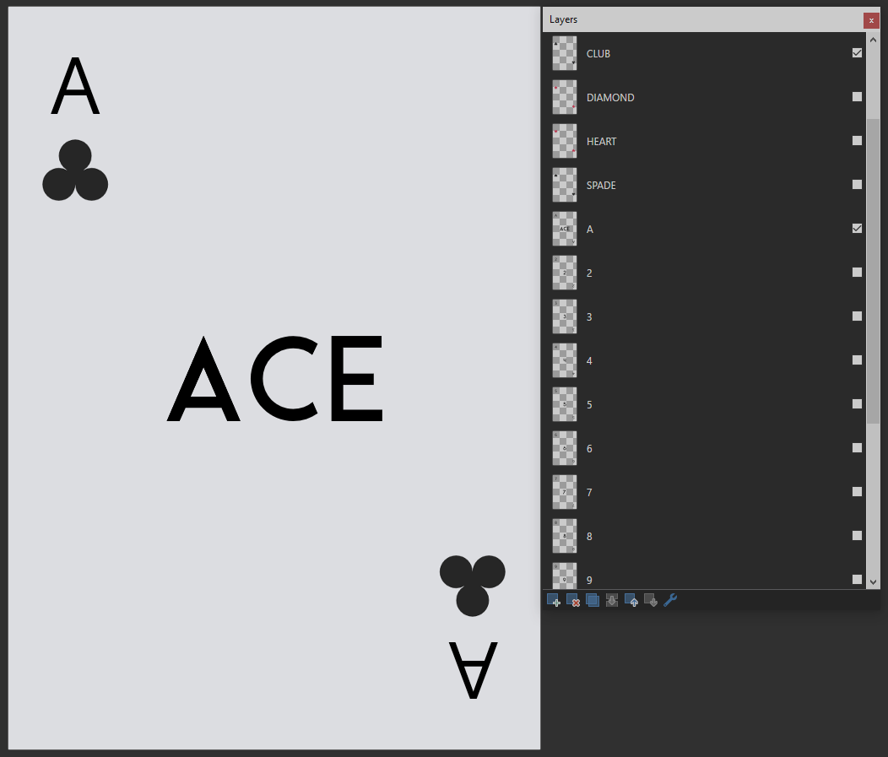

# Poker Game

An open source web Poker game that I made to play against AI with my own card themes, rules and everything.

## Card Making

All the cards were made by me. For this, I created the ``!CARD MODEL.pdn`` file, inside the ``/cards/src`` folder, in a way that changing any element in the cards layout turns into a simple task.

> The ``.pdn`` file means that the card model were made with [Paint.net](https://www.getpaint.net/). Photoshop support will come in future updates, so don't worry.

___
For example: in the image bellow, the `CLUB` and `A` layer's checkbox are checked, so you get an Ace of Clubs.

